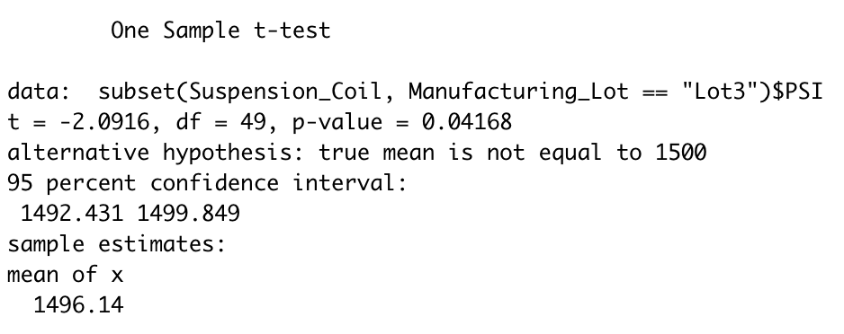

# MechaCar_Statistical_Analysis

# Tools Used

R Studio & Statistics 

# Backround

A few weeks after starting his new role, Jeremy is approached by upper management about a special project. AutosRUs’ newest prototype, the MechaCar, is suffering from production troubles that are blocking the manufacturing team’s progress. AutosRUs’ upper management has called on Jeremy and the data analytics team to review the production data for insights that may help the manufacturing team.

In this challenge, you’ll help Jeremy and the data analytics team do the following:

Perform multiple linear regression analysis to identify which variables in the dataset predict the mpg of MechaCar prototypes
Collect summary statistics on the pounds per square inch (PSI) of the suspension coils from the manufacturing lots
Run t-tests to determine if the manufacturing lots are statistically different from the mean population
Design a statistical study to compare vehicle performance of the MechaCar vehicles against vehicles from other manufacturers. For each statistical analysis, you’ll write a summary interpretation of the findings.

# Deliverable 1: Linear Regression to Predict MPG

Question 1 - Which variables/coefficients provided a non-random amount of variance to the mpg values in the dataset?

ANSWER- Each Pr(>|t|) value represents the probability that each coefficient contributes a random amount of variance to the linear model.
Vechicle length and ground clearance have signaficant impact on mpg.

Question 2- Is the slope of the linear model considered to be zero? Why or why not?

ANSWER- The Intercept is Statistically Signficant.

Question 3- Does this linear model predict mpg of MechaCar prototypes effectively? Why or why not?

ANSWER- Multiple R-Squared Value is 0.71

# Deliverable 2: Summary Statistics on Suspension Coils

Q1 - The design specifications for the MechaCar suspension coils dictate that the variance of the suspension coils must not exceed 100 pounds per square inch. Does the current manufacturing data meet this design specification for all manufacturing lots in total and each lot individually? Why or why not?

A1- In Total the specification are met with variance of 62.29

A2- By lots 1 & 2 are written with specifications, however lot 3 has a variance that has exceed expectations.

# Deliverable 3: T-Test on Suspension Coils
Lot 1 is NOT signicantly different from the population mean (with a p-value of 1)

Lot 2 is NOT signicantly different from the population mean (with a p-value of .6072)

Lot 3 is signicantly different from the population mean (with a p-value of .04168)

# Deliverable 4: Design a Study Comparing the MechaCar to the Competition

## Study Design: MechaCar vs Competition.

The biggest impacts to MPG are AWD Capapility, weight and spoiler angle.  These are the 3 variables to consider on the MPG f the MechaCar.

### What metric or metrics are you going to test? 

* MPG
* Average Annual Cost of Ownership
* Resale Value
* Engine
* Drive Package
* Current Price
* Saftety Feature Rating

### What is the null hypothesis or alternative hypothesis?

* Null Hypothesis: MechaCar is priced correctly based on its performance of key factors for its genre.

* Alternative Hypothesis: MechaCar is NOT priced correctly based on performance of key factors for its genre.

### What statistical test would you use to test the hypothesis? And why?

Multiple linear regression is used to test the hypthesis. 

### What data is needed to run the statistical test? 

A random sample of n > 30 for MechaCar.

